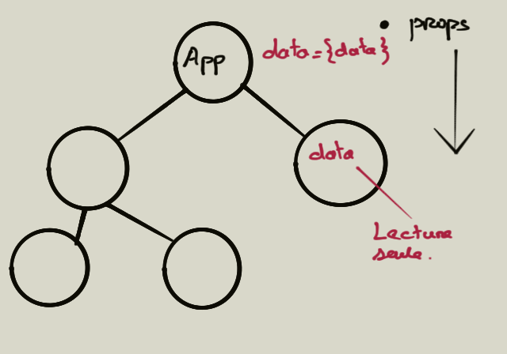

# Les props

Que l'on définisse un composant avec une classe ou une fonction, les props sont en lecture seule.

La philosophie des développeurs de Facebook a imposée cette rigueur au niveau de ces valeurs. Les props s'écoulent du haut vers le bas et une fois entrées dans un composant depuis un parent ne peuvent être changées par l'enfant. C'est pour cela qu'on dit qu'une props est en **LECTURE SEULE** dans un composant donné.



\newpage

Les props peuvent se définir dans les attributs des composants sous forme de clés/valeurs :

```js

  <Hello name="Alan" />

```

Elles seront récupérées dans les arguments de la fonction du composant :

```js
const Hello = (props) => {
  // porps.name = "Autre chose" IMPOSSIBLE

  return <h1>Hello, {props.name}</h1>;
}

```

Vous pouvez également définir un composant avec une classe ES6. La classe devra étendre de React.Component, le nom de la classe est le nom du composant.
**Mais attention là encore les props sont en lecture seule**. Par la suite nous utiliserons des classes pour créer des composants. Elles sont plus faciles à manipuler pour définir un composant au début que les fonctions dans React.

```js

class HelloReact extends React.Component{
  constructor(props){
    super(props);
  }

  render() {
      return (
         <p>{this.props.name}</p>
      )
  }
}

ReactDOM.render(
    // attribut cle/valeur == props
    <HelloReact name="Hello React" />,
    document.getElementById('root')
);

```

## 1. Exercice props

Définissez une constante "messages" dans le composant App, qui contiendra des messages, puis créez un composant Messages et un autre composant Message qui affichera les messages se trouvant dans la constante.

Vous pouvez en effet avoir un composant dans un composant. Les composants de React sont déclaratifs comme les balises HTML.

Voici pour vous aider la hiérarchie des composants :

```txt

    App
     .
     .
  Messages
     .
     .
  Message
```

**Indications** : créez trois classes dans le même fichier. Utilisez la source ex1_props.html du cours pour commencer. Et n'oubliez pas d'utiliser map pour parcourir les messages et les afficher.

## Exercice

Créez une constantes dans laquelle on écrira 5 posts avec la structure JSON : title : "Un titre", content : "un texte".

Créez un composant App et organisez au mieux l'affichage de ces posts.

```js

const POSTS = [
  {title : "React Introduction" , content : "Un peu de texte"},
  {title : "React Props" , content : "Un peu de texte sur les props"},
  {title : "React State" , content : "Un peu de texte sur les states"},
  {title : "React Event" , content : "Un peu de texte event"},
  {title : "React Native" , content : "Un peu de texte sur React Native"},

];

```

## 2. Exercice Clock

Pour faire cet exercice dans un fichier ex2_clock.html comme pour l'exercice précédent importez les dépendances React.

Définir un composant Clock et essayez d'implémenter une horologe. Faites en sorte que dans le DOM l'horloge se mette à jour et affiche les secondes, minutes et heures qui passent.

```txt
  10h 25m 30s
```
